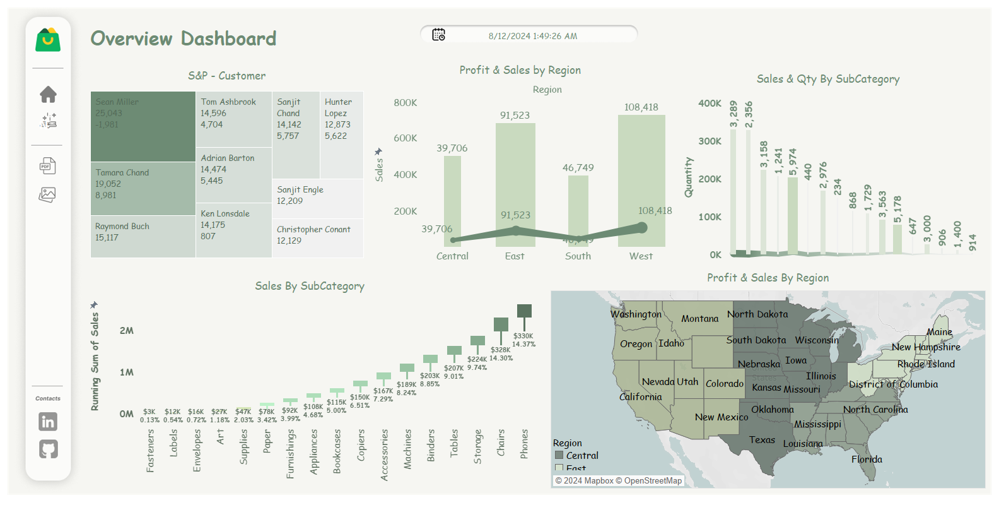
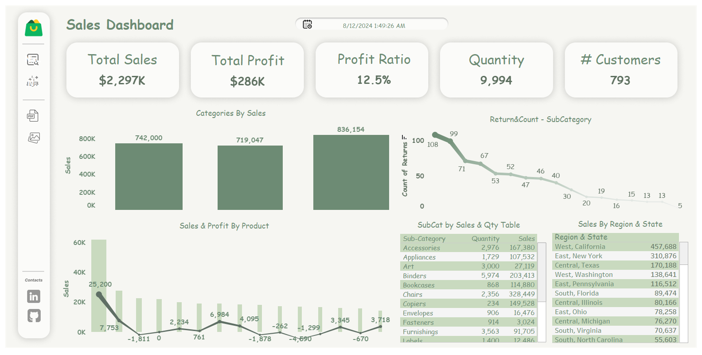

This Tableau dashboard provides an in-depth analysis of sales performance, customer behavior, and regional trends. The dashboards are designed to help businesses understand key metrics like total sales, profit, and customer distribution, and to identify areas of opportunity.

Key Metrics:

Total Sales: $2,297K
Total Profit: $286K
Profit Ratio: 12.5%
Quantity Sold: 9,994 units
Number of Customers: 793
Sales by Category and Product:

Visualizes total sales and profits by different categories and products, helping to identify the top-performing areas.
Return & Count by SubCategory:

This line chart displays the count of returns across various subcategories, offering insights into which products have higher return rates.
Sales by Region & State:

Highlights sales performance across different regions and states, with a detailed breakdown of sales figures by state.
Sales & Profit by SubCategory:

Displays sales and profit data across different subcategories, providing a clear view of profitability by product type.
Overview Dashboard
S&P - Customer:

A treemap visualization that shows sales and profit figures for individual customers, allowing for the identification of key customer segments.
Profit & Sales by Region:

A bar and line chart combination that compares profit and sales across different regions, offering a regional perspective on business performance.
Sales by SubCategory:

A bar chart showcasing the running sum of sales across various subcategories, highlighting top-performing product categories.
Sales & Quantity by SubCategory:

This chart presents a detailed comparison of sales and quantities across different subcategories, helping to understand demand patterns.
Profit & Sales by Region - Map View:

An interactive map visualization that breaks down profit and sales by region, providing a geographic analysis of business performance.

You can explore the full project on Tableau Public here. I’d love to hear your feedback!: https://lnkd.in/dTZyjW69
